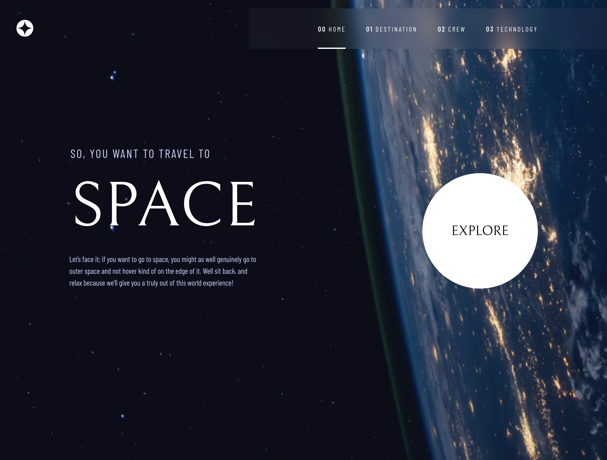

# Space Tourism

---

## 📕 About

Space Tourism is an outer space exploring info app, based on a Frontend Mentor challenge, wich you can check by clicking [here](https://www.frontendmentor.io/challenges/space-tourism-multipage-website-gRWj1URZ3).

---

## ⚒️ Used Technologies

To develop this app, I used these technologies:

- NextJS (Create Next App)
- Typescript
- SCSS

---

## ✨ Features

- Responsivity
- PWA Features, such as offline support

---

## ⚙️ How to Use

First, clone the repository.

Inside the project folder, run `yarn` or `yarn install` to install the dependencies.

Then, run `yarn dev` to start a local development server.

---

## 🤝 Be a Contributor

Have any idea that can help boost the project, and want to share it? It's simple!

1. Fork the project
2. Modify what you want
3. Commit the changes
4. Open a Pull Request

---

## 🔓 License

This project is under license. Click [here](./LICENSE.md) for details.
